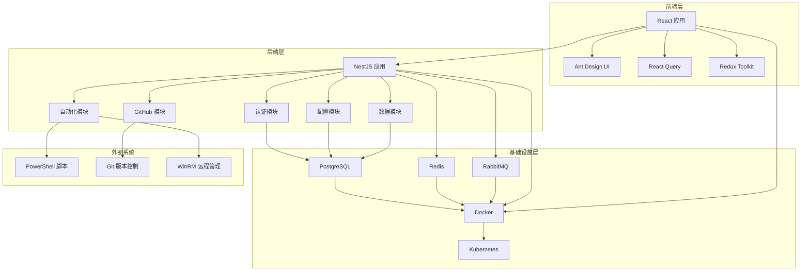
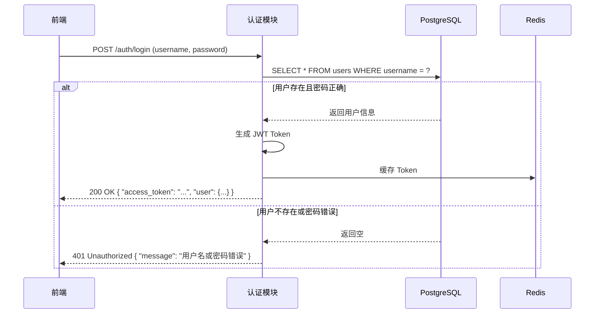
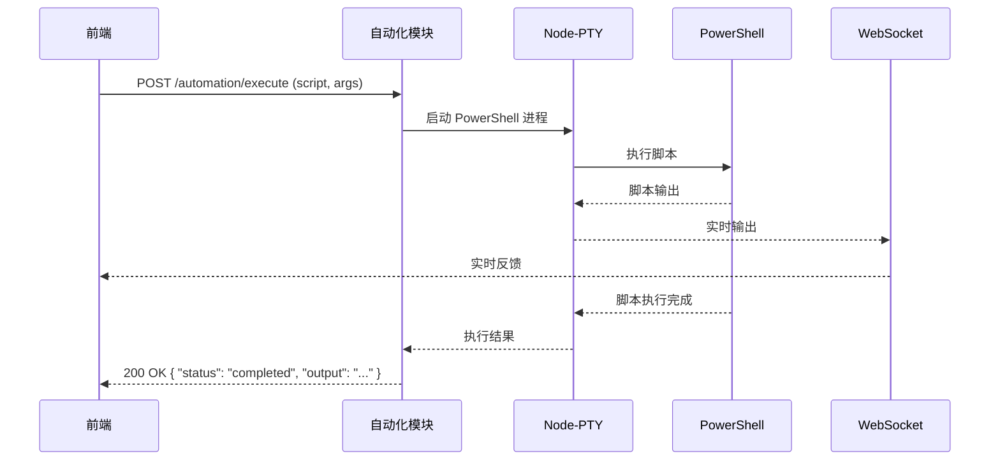
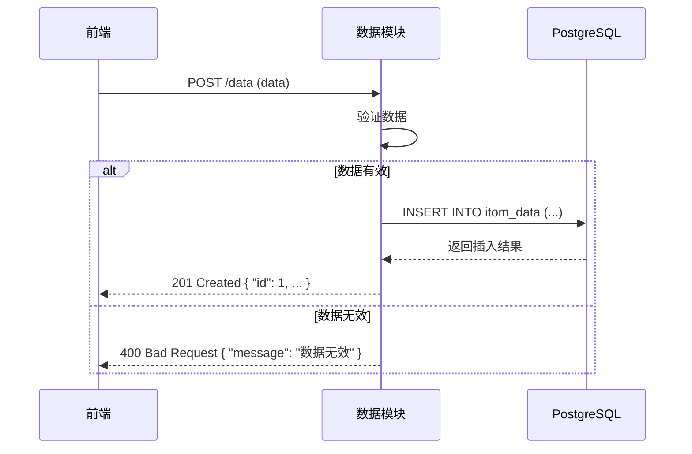

# SuperITOM_TS 技术架构

## 一、整体架构

SuperITOM_TS 采用微服务架构，前后端分离设计，使用 TypeScript 作为统一开发语言。



## 二、核心模块设计

### 1. 认证模块

**功能**：用户登录、注册、权限控制

**技术实现**：
- NestJS + Passport.js + JWT
- PostgreSQL 存储用户信息
- Redis 缓存会话信息

**API 设计**：
- `POST /auth/login` - 用户登录
- `POST /auth/register` - 用户注册
- `POST /auth/logout` - 用户注销
- `GET /auth/profile` - 获取用户信息

### 2. 配置模块

**功能**：系统配置管理

**技术实现**：
- NestJS + TypeORM
- PostgreSQL 存储配置信息

**API 设计**：
- `GET /config` - 获取所有配置
- `GET /config/:key` - 获取指定配置
- `POST /config` - 添加配置
- `PUT /config/:id` - 更新配置
- `DELETE /config/:id` - 删除配置

### 3. 数据模块

**功能**：数据管理、存储

**技术实现**：
- NestJS + TypeORM
- PostgreSQL 存储数据

**API 设计**：
- `GET /data` - 获取所有数据
- `GET /data/:id` - 获取指定数据
- `POST /data` - 添加数据
- `PUT /data/:id` - 更新数据
- `DELETE /data/:id` - 删除数据

### 4. 自动化模块

**功能**：PowerShell 脚本执行

**技术实现**：
- NestJS + Node-PTY
- WebSocket 实时反馈

**API 设计**：
- `GET /automation/scripts` - 获取可用脚本
- `POST /automation/execute` - 执行脚本
- `GET /automation/history` - 获取执行历史

### 5. GitHub 模块

**功能**：代码版本管理

**技术实现**：
- NestJS + Git

**API 设计**：
- `GET /github/status` - 获取 Git 状态
- `POST /github/commit` - 提交代码
- `POST /github/pull` - 拉取代码
- `POST /github/push` - 推送代码

### 6. 可视化模块

**功能**：数据可视化、报表生成

**技术实现**：
- NestJS + ECharts

**API 设计**：
- `GET /visualization/chart` - 生成图表
- `GET /visualization/report` - 生成报表

## 三、数据流设计

### 1. 用户认证流程



### 2. 脚本执行流程



### 3. 数据管理流程



## 四、技术选型理由

### 1. 前端技术

- **React**：组件化开发，生态丰富，适合构建复杂 UI
- **TypeScript**：类型安全，减少运行时错误
- **Ant Design**：企业级 UI 组件库，设计规范统一
- **React Query**：数据请求管理，缓存优化
- **Redux Toolkit**：状态管理，简化 Redux 使用

### 2. 后端技术

- **NestJS**：企业级 Node.js 框架，模块化设计，依赖注入
- **TypeScript**：类型安全，代码可维护性高
- **TypeORM**：对象关系映射，简化数据库操作
- **Passport.js**：认证中间件，支持多种认证策略
- **Node-PTY**：伪终端，执行交互式命令

### 3. 数据库技术

- **PostgreSQL**：强大的关系型数据库，支持复杂查询和事务
- **Redis**：内存数据库，用于缓存和会话管理
- **RabbitMQ**：消息队列，用于异步处理和服务解耦

### 4. 部署技术

- **Docker**：容器化部署，环境一致性
- **Kubernetes**：容器编排，自动扩缩容，负载均衡

## 五、开发范式

### 1. 模块化开发

SuperITOM_TS 采用严格的模块化开发方式，确保代码的可维护性和可扩展性。

#### 1.1 后端模块化

- **模块划分**：基于业务功能划分为认证、配置、数据、自动化、GitHub 等独立模块
- **模块结构**：每个模块包含控制器、服务、数据模型、DTO 等组件
- **模块通信**：通过依赖注入和服务引用实现模块间通信
- **模块边界**：每个模块有清晰的职责边界，避免跨模块耦合

**模块结构示例**：
```
backend/src/modules/
├── auth/              # 认证模块
│   ├── controllers/   # 控制器
│   ├── services/      # 服务
│   ├── entities/      # 数据模型
│   ├── dto/           # 数据传输对象
│   └── strategies/    # 认证策略
├── automation/        # 自动化模块
├── data/              # 数据模块
└── github/            # GitHub 模块
```

#### 1.2 前端模块化

- **组件模块化**：UI 组件按功能划分为通用组件和页面组件
- **状态模块化**：Redux 状态按业务领域划分为多个 slice
- **路由模块化**：路由配置按功能模块组织
- **服务模块化**：API 调用按功能模块封装

**模块结构示例**：
```
frontend/src/
├── components/        # 通用组件
│   ├── Header/        # 头部组件
│   ├── Sidebar/       # 侧边栏组件
│   └── ProtectedRoute/ # 路由保护组件
├── pages/             # 页面组件
│   ├── Login/         # 登录页面
│   ├── Dashboard/     # 仪表板页面
│   └── Automation/    # 自动化页面
├── services/          # API 服务
└── store/             # Redux 状态管理
```

### 2. 函数式开发

SuperITOM_TS 采用函数式编程范式，强调纯函数、不可变性和函数组合，提高代码的可测试性和可维护性。

#### 2.1 核心函数式概念

- **纯函数**：相同输入总是产生相同输出，无副作用
- **不可变性**：数据一旦创建，不能被修改
- **函数组合**：通过组合小函数构建复杂功能
- **高阶函数**：接受函数作为参数或返回函数
- **函数式工具**：使用 Ramda.js、fp-ts 等函数式库

#### 2.2 后端函数式实践

- **服务层**：业务逻辑实现为纯函数
- **数据转换**：使用函数式方法处理数据转换
- **错误处理**：使用 Either 类型或 Result 类型处理错误
- **依赖注入**：使用函数式依赖注入，避免副作用

**示例代码**：
```typescript
// 纯函数示例
function calculateExecutionTime(startTime: Date, endTime: Date): number {
  return endTime.getTime() - startTime.getTime();
}

// 函数组合示例
function processScriptOutput(output: string): string[] {
  return R.pipe(
    R.split('\n'),
    R.filter(line => line.trim() !== ''),
    R.map(line => line.trim())
  )(output);
}
```

#### 2.3 前端函数式实践

- **组件设计**：使用函数组件和 Hooks
- **状态管理**：使用 Redux Toolkit 的 createSlice，避免直接修改状态
- **数据处理**：使用函数式方法处理 API 响应数据
- **副作用管理**：使用 useEffect 和 React Query 管理副作用

**示例代码**：
```typescript
// 函数组件示例
const ScriptList: React.FC = () => {
  const { data: scripts, isLoading } = useQuery('scripts', fetchScripts);
  
  return (
    <List
      loading={isLoading}
      dataSource={scripts || []}
      renderItem={script => (
        <List.Item>
          <ScriptItem script={script} />
        </List.Item>
      )}
    />
  );
};

// 纯函数处理数据
function formatScriptExecutionTime(seconds: number): string {
  return `${Math.floor(seconds / 60)}m ${seconds % 60}s`;
}
```

#### 2.4 函数式优势

- **代码可测试性**：纯函数易于编写单元测试
- **代码可维护性**：函数职责单一，逻辑清晰
- **并行处理**：纯函数适合并行执行
- **错误隔离**：函数式错误处理避免错误传播
- **状态预测**：不可变性使状态变化可预测

## 六、性能优化策略

### 1. 前端优化

- **代码分割**：使用 React.lazy 和 Suspense 实现组件懒加载
- **虚拟列表**：使用 react-window 处理大量数据列表
- **缓存策略**：使用 React Query 缓存 API 请求结果
- **减少重渲染**：使用 useMemo 和 useCallback 优化组件性能
- **图片优化**：使用 WebP 格式和图片懒加载

### 2. 后端优化

- **数据库索引**：为频繁查询的字段创建索引
- **连接池**：使用数据库连接池管理连接
- **缓存**：使用 Redis 缓存热点数据
- **异步处理**：使用 NestJS 的异步处理能力
- **批处理**：批量处理数据库操作

### 3. 系统优化

- **负载均衡**：使用 Nginx 或 Kubernetes 负载均衡
- **水平扩展**：根据负载自动扩展服务实例
- **监控**：使用 Prometheus + Grafana 监控系统性能
- **日志管理**：使用 ELK 栈管理日志
- **灾备方案**：实现数据备份和恢复机制

## 六、安全策略

### 1. 前端安全

- **输入验证**：使用 Ant Design 的表单验证
- **XSS 防护**：使用 React 的自动转义
- **CSRF 防护**：使用 JWT 无状态认证
- **敏感信息保护**：不在前端存储敏感信息

### 2. 后端安全

- **认证授权**：使用 Passport.js 和 JWT
- **输入验证**：使用 NestJS 的管道验证
- **SQL 注入防护**：使用 TypeORM 参数化查询
- **跨域保护**：使用 CORS 中间件
- **速率限制**：防止暴力破解

### 3. 系统安全

- **网络隔离**：使用 Kubernetes 网络策略
- **密钥管理**：使用环境变量或密钥管理服务
- **安全审计**：记录关键操作日志
- **定期更新**：更新依赖包和系统组件
- **漏洞扫描**：定期进行安全扫描

## 七、监控策略

### 1. 应用监控

- **健康检查**：使用 NestJS 的健康检查模块
- **性能指标**：使用 Prometheus 收集指标
- **告警机制**：使用 Alertmanager 配置告警
- **分布式追踪**：使用 Jaeger 追踪请求

### 2. 系统监控

- **资源使用**：监控 CPU、内存、磁盘使用
- **网络流量**：监控网络带宽和连接数
- **服务状态**：监控服务可用性和响应时间
- **数据库性能**：监控数据库查询性能

### 3. 日志管理

- **结构化日志**：使用 JSON 格式记录日志
- **集中存储**：使用 Elasticsearch 存储日志
- **日志分析**：使用 Kibana 分析日志
- **日志轮转**：配置日志轮转策略

## 八、扩展性设计

### 1. 模块扩展性

- **模块化设计**：使用 NestJS 的模块化系统
- **插件机制**：支持自定义插件
- **钩子系统**：提供扩展点

### 2. 水平扩展性

- **无状态设计**：服务实例无状态，可水平扩展
- **数据分片**：支持数据库分片
- **负载均衡**：自动负载均衡

### 3. 集成扩展性

- **API 网关**：统一 API 管理
- **Webhooks**：支持外部系统集成
- **事件驱动**：使用 RabbitMQ 实现事件驱动架构

## 九、结论

SuperITOM_TS 采用现代化的 TypeScript 全栈技术栈，结合微服务架构和容器化部署，为 IT 运维自动化管理系统提供了高性能、可扩展、安全可靠的解决方案。

通过合理的模块设计、数据流规划和性能优化策略，SuperITOM_TS 能够满足企业级应用的需求，支持 100+ 用户的并发访问，同时为未来的功能扩展和系统集成提供了良好的基础。